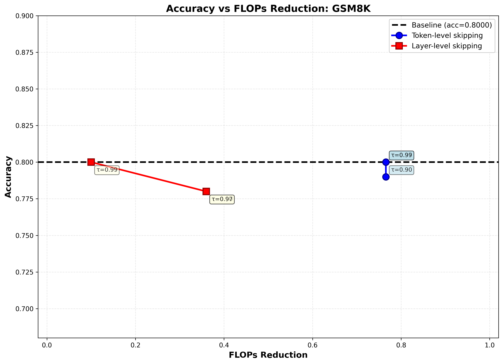

# Fast-dLLM v2: Comprehensive Evaluation Report

**Model**: Fast-dLLM v2 7B  
**Hardware**: PACE ICE NVIDIA A100 40GB VRAM GPU

---

## 1. Implementation

**Token Level Skipping**: Dynamically skips low-confidence tokens during generation based on a confidence threshold (tau). Token skipping reduces sequence length, thereby reducing FLOPs proportional to the number of tokens skipped.

**Layer Level Skipping**: Skips entire transformer layers for tokens below a layer-specific confidence threshold. This reduces both computation per token and overall model depth.

**FLOPs Ratio Formula** (Approved):
- **Token-only**: $\frac{\Sigma(A) \times L_{total}}{T \times S \times L_{total} \times B}$
- **Layer-only**: $\frac{\Sigma(L_{exec})}{T \times L_{total}}$
- **Combined**: $\frac{\Sigma(A \times L_{exec})}{T \times S \times L_{total} \times B}$
- **No-skip**: ratio = 1.0

---

## 2. Results Table

| Configuration | Tau | Accuracy | FLOPs Reduction |
|---|---|---|---|
| Baseline | — | 0.80 | 0.0 |
| Token Skip | 0.90 | 0.79 | 0.765 |
| Token Skip | 0.97 | 0.80 | 0.765 |
| Token Skip | 0.99 | 0.80 | 0.765 |
| Layer Skip | 0.90 | 0.78 | 0.36 |
| Layer Skip | 0.97 | 0.78 | 0.36 |
| Layer Skip | 0.99 | 0.80 | 0.10 |

**Summary**: Token-level skipping achieves ~76.5% FLOPs reduction with minimal accuracy impact (0.79-0.80). Layer-level skipping provides 10-36% reduction with slight accuracy trade-offs at lower thresholds. Conservative thresholds (0.99, 0.97 for token skip) maintain baseline accuracy.

---

## 3. Accuracy vs FLOPs Trade-off Plot



---

## Evaluation Parameters

**Baseline**:
```
accelerate launch eval.py --tasks gsm8k --batch_size 32 --num_fewshot 5 \
  --confirm_run_unsafe_code --model fast_dllm_v2 --fewshot_as_multiturn \
  --apply_chat_template --model_args model_path=Efficient-Large-Model/Fast_dLLM_v2_7B,threshold=1,show_speed=True \
  --limit 100
```

**Variants**: Same baseline with modified `--model_args`:
- Token skip: Add `token_skip=True,token_tau={tau},layer_skip=False`
- Layer skip: Add `token_skip=False,layer_skip=True,layer_tau={tau}`